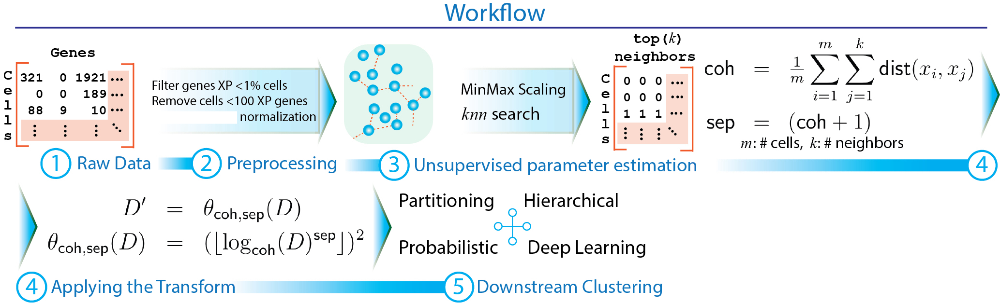

## p-ClustVal: A Novel p-adic Approach for Enhanced Clustering of High-Dimensional Single Cell RNASeq Data

**p-ClustVal** is a novel data transformation technique inspired by p-adic number theory that significantly enhances cluster discernibility in genomics data, specifically Single Cell RNA Sequencing (scRNASeq). By leveraging p-adic-valuation, p-ClustVal integrates with and augments
widely used clustering algorithms and dimension reduction techniques, amplifying their effectiveness in discovering meaningful structure from data. The transformation uses a data-centric heuristic to determine optimal parameters, without relying on ground truth labels, making it more user-friendly. p-ClustVal reduces overlap between clusters by employing alternate metric spaces inspired by p-adic-valuation, a significant shift from conventional methods. Our comprehensive evaluation spanning 30 experiments and over 1400 observations, shows that p-ClustVal improves performance in 91% of cases, and boosts the performance of classical and state of the art (SOTA) methods. This work contributes to data analytics and genomics by introducing a unique data transformation approach, enhancing downstream clustering algorithms, and providing empirical evidence of p-ClustVal’s efficacy. The study concludes with insights into the limitations of p-ClustVal and future research directions.


### Workflow of p-adic transformation

<div align="center">
  
  </br>
</div>

__Figure 1:__ **Data generation phase:** The samples are extracted from the tissue of interest, followed by cell library preparation and high throughput sequencing. The obtained sequences are aligned with a reference genome. The result is a matrix that stores gene transcripts counts per cell. **Data analysis phase:** The data goes through initial quality control to remove low quality cells and genes, normalization, feature subset selection or dimensionality reduction, building cell similarity matrix either in the lower dimensional or original feature space, and clustering.


### Dependency

The code base is written in Python3 and illustrative scripts are shared in respective directories. For benchmarking other published packages, following R packages needs to be installed in R. These packages are available for install from standard R command line.

	- DR.SC (install.packages("DR.SC"))

	- RaceID (install.packages("SIMLR"))

	- SIMLR (install.packages("RaceID"))

	- Seurat (install.packages("Seurat"))


### How to replicate the results

- Python scripts for running specific experiments are present in relevant directories, for example:

1. benchmark_accuracy: contains scripts for running the clustering experiments.
2. benchmark_dim_reduction: contains scripts for running the dimensionality reduction experiments.
3. benchmark_scRNA_packages: contains the scripts for benchmarking state-of-the-art packages for clustering single cell data. 

We will show an example of reproducing the results for the clustering experiment. The process for other experiments remains the same, except the name of the script that need to be run. For generating the results shown in Figure-6 of the manuscript, follow the steps:

	1. Create a new folder named 'raw_data'. All datasets should be stored inside this folder. The link to various datasets used in ths study are given in the [Paper](https://link.springer.com/article/10.1007/s41060-024-00709-4).

	2. Change the directory to the 'benchmark_accuracy' and copy the script 'benchmark_kpp_all_algos.py' in the same directory as 'raw_data'.

	```
	cd benchmark_accuracy
	# Copy the benchmark_kpp_all_algos.py script to the folder containing the 'raw_data' directory.
	```

	3. Run the script on the command line

	```
	python3 benchmark_kpp_all_algos.py
	```


#### Related Work

Check out paper on BioArchive [Paper](https://www.biorxiv.org/content/10.1101/2024.10.18.619153v2)

Check out the paper on the journal website [Paper](https://link.springer.com/article/10.1007/s41060-024-00709-4)

### Contact Details

For help with running, or reporting issues-please let us know at __parishar__[at]__iu__[dot]__edu__. We would be happy to help you out.


